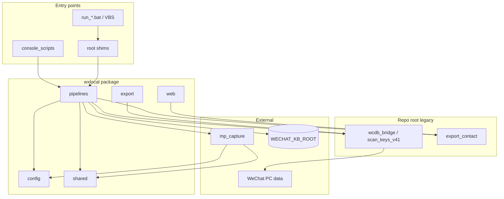

# wxlocal architecture

> Module dependency and runtime layout after Phase R (R0–R5).

## Pipelines

| Pipeline | Console script | Daemon module | KB subtree |
|----------|----------------|---------------|------------|
| chat-watch | `wxlocal-watch` | `wxlocal.pipelines.chat_watch.daemon` | `wechat/chat-watch/` or legacy `wechat/ninjasin/` |
| mp-scroll | `wxlocal-mp-scroll` | `wxlocal.pipelines.mp_scroll.daemon` | `wechat/mp-scroll/` |
| export CLI | `wxlocal-export` | `wxlocal.export.cli` | `output/` |
| Web UI | `wxlocal-web` | `wxlocal.web.app` | `output/decrypted/` |

## Package layout

```
wxlocal/
├── config/           # env, paths (split by pipeline), WeChat data roots
│   └── paths/        # chat_watch, mp_scroll, mp_capture, runtime, kb
├── shared/           # dedup, mp_filter, http_fetch, daemon (pid/logging)
├── pipelines/
│   ├── chat_watch/   # contact sync daemon
│   └── mp_scroll/    # IndexedDB scroll daemon
├── web/              # Flask app + service layer
├── export/           # one-shot decrypt/export CLI
└── _legacy.py        # repo-root import bootstrap (pip install)

mp_capture/           # IDB readers, OCR, registry orchestration (uses wxlocal.shared)
scripts/              # daemon_status, verify, ops
launchers/win/        # shared VBS bootstrap
```

Root `*.py` files remain **shims** for bat/VBS and ad-hoc scripts; new code should import from `wxlocal.*`.

## Dependency flow



**Import rule:** `mp_capture` and `wxlocal.*` must not import each other circularly. Shared logic lives in `wxlocal.shared`; `mp_capture` calls into it, not the reverse.

## PID and logs (R5)

| Pipeline | PID file (canonical) | Legacy PID | Repo log |
|----------|----------------------|------------|----------|
| chat-watch | `{state}/chat_watch.pid` | `ninjasin_watch.pid` | `output/chat_watch.log` |
| mp-scroll | `{state}/mp_scroll.pid` | `mp_idb_watch.pid` | `output/mp_scroll.log` |

`acquire_pid_lock()` migrates legacy pid files on first start. `scripts/daemon_status.py` is the single stop/status implementation.

## Autostart chain

```
WxLocalAutostart.vbs
  → bootstrap_autostart.py (wait_for_paths, resolve pythonw)
    → bootstrap_mp_scroll.py
    → bootstrap_chat_watch.py
      → launchers/win/run_daemon.vbs  (manual run_*.bat path)
```

## Deliberately out of scope

- `scripts/research/` probes (not production)
- `vendor/wcdb-key-tool-main/` internals
- wenjin / downstream KB consumers
