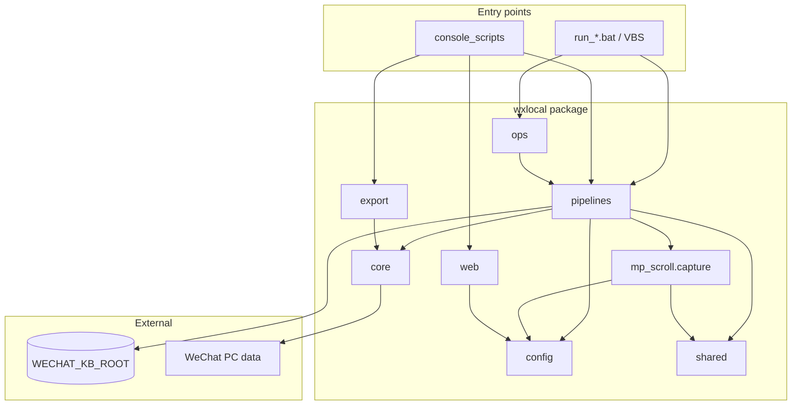

# wxlocal architecture

> Module dependency and runtime layout after Phase R (R0–R10). **v0.2.0**: root `.py` = 0.

## Pipelines

| Pipeline | Console script | Daemon module | KB subtree |
|----------|----------------|---------------|------------|
| chat-watch | `wxlocal-watch` | `wxlocal.pipelines.chat_watch.daemon` | `wechat/chat-watch/` or legacy `wechat/ninjasin/` |
| mp-scroll | `wxlocal-mp-scroll` | `wxlocal.pipelines.mp_scroll.daemon` | `wechat/mp-scroll/` |
| export CLI | `wxlocal-export` | `wxlocal.export.cli` | `output/` |
| Web UI | `wxlocal-web` | `wxlocal.web.app` | `output/decrypted/` |

## Package layout

```
wxlocal/
├── config/           # env, paths (split by pipeline), WeChat data roots
│   └── paths/        # chat_watch, mp_scroll, mp_capture, runtime, kb
├── core/             # wcdb, decrypt, keys, messages, subprocess_win
├── shared/           # dedup, mp_filter, http_fetch, daemon (pid/logging)
├── ops/              # autostart helpers + login bootstrap
├── pipelines/
│   ├── chat_watch/   # contact sync daemon + export/archive
│   └── mp_scroll/    # IndexedDB scroll + capture/ (ex-mp_capture)
├── web/              # Flask app + service layer
└── export/           # one-shot decrypt/export CLI

scripts/              # daemon_status, verify, ops, research
launchers/win/        # shared VBS bootstrap (-m module)
```

Root has **0** `.py` files; entry via bat/vbs or console scripts.

## Dependency flow



## PID and logs

| Pipeline | PID file (canonical) | Legacy PID | Repo log |
|----------|----------------------|------------|----------|
| chat-watch | `{state}/chat_watch.pid` | `ninjasin_watch.pid` | `output/chat_watch.log` |
| mp-scroll | `{state}/mp_scroll.pid` | `mp_idb_watch.pid` | `output/mp_scroll.log` |

`acquire_pid_lock()` migrates legacy pid files on first start. `scripts/daemon_status.py` is the single stop/status implementation.

## Autostart chain

```
WxLocalAutostart.vbs
  → pythonw -m wxlocal.ops.bootstrap_autostart
    → -m wxlocal.pipelines.mp_scroll.bootstrap
    → -m wxlocal.pipelines.chat_watch.bootstrap
Manual: run_*.bat → launchers/win/run_daemon.vbs -m …
```

## Deliberately out of scope

- `scripts/research/` probes (not production)
- `vendor/wcdb-key-tool-main/` internals
- wenjin / downstream KB consumers
